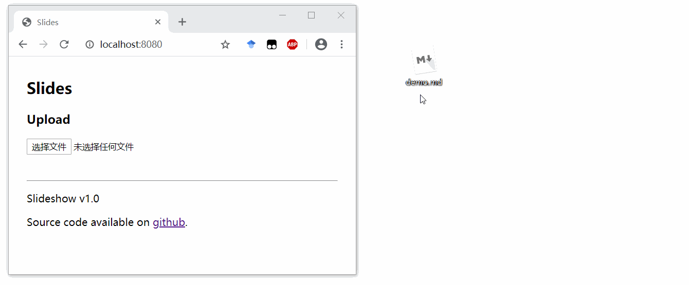

# Slideshow


Slideshow server is a markdown slide live presentation server. This means your audience will automatically follow your slide position through a URL you give them.

The synchronization is not limited on one computer, which the out-of-box implementation of presenter mode of popular frameworks like Marp, nodePPT, etc. requires. Being able to access the server is the only requirement when using slideshow to make your live presentation. When you navigate your slides, the movements will be sent to Slideshow server, and then distributed to the viewers.

## Install and use
Download the repo, then run `npm install` to install the requirements.

After that, copy `config.sample.js` to `config.js` and modify it as you want.

``` javascript
module.exports = {
    host: '0.0.0.0',
    port: '8080',
    auth: {'admin': '123456'},
};
```

the `auth` field is the admin user and password required when uploading slides to the server.

Then run `node index.js` to start the server.

Then open your browser and go to http://localhost:8080/, login use your username and password, then upload a markdown file.

When the upload succeed, three URLs named `View`, `Presenter`, `Standalone` will be presented accordingly. Give your audience the `View` URL to open in their browser (they don't need the admin user and password). Use the `Presenter` URL to control your slides. the `Standalone` URL won't connect to the sync server, it's for presentation without the need of remote control.

## Markdown Syntax
The backend of this project is [Marp](https://github.com/marp-team/marp), which is an easy-to-use markdown slides generation tool. Its syntax is very simple. Just split pages by horizontal ruler (`---`).

``` markdown
# Slide 1

foobar

---

# Slide 2

foobar
```

For more advanced usage and layout control, please refer to [Marp Documentation](https://marpit.marp.app/markdown).

## License
This project is released under the [GNU Affero General Public License Version 3].

Commercial dual license available. Please contact the author Zizheng Guo (gzz_2000 [AT] 126.com) for details.

This project uses a modified version of [Marp Cli](https://github.com/marp-team/marp-cli) (MIT License) and a modified version of [Bespoke Sync](https://github.com/medikoo/bespoke-sync) (ISC License). I won't be able to create this project without these excellent open source projects.

PR and issues are welcomed.
